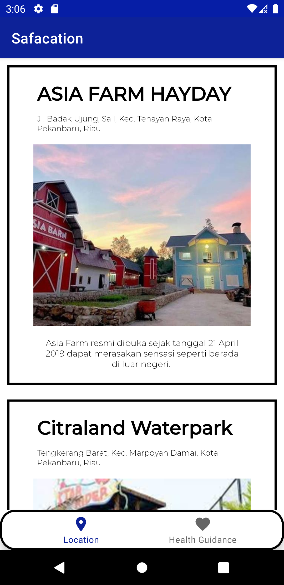
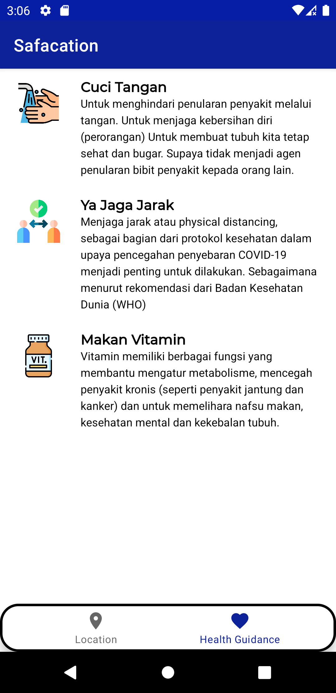
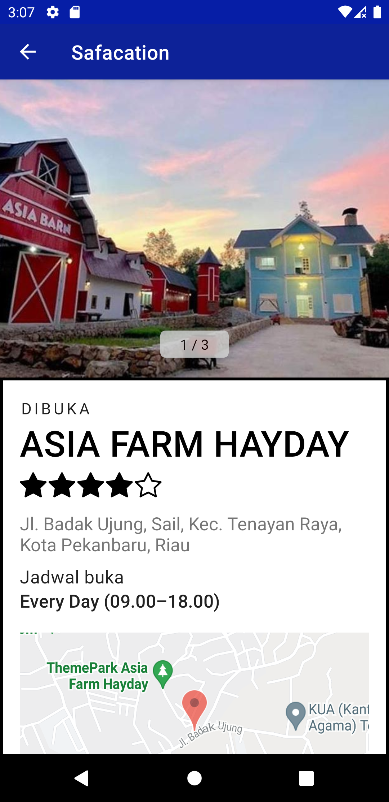

# Safacation
## Google Maps Platform API Key
Safacation requires the Google Cloud API Key with restriction on two specific call, which are `Maps SDK for Android` and `Places API`. This API key then will be use for displaying map on specific location on each detail page and to pull user reviews from Google Maps. You can visit [Google Maps Platform](https://developers.google.com/maps) to get this API key

For test purposes, you may clone this repository and import it into **Android Studio**. But as previously mentioned, before you can run it normally to a device, you need to include your Google Cloud API key into `local.properties`. This is a hard requirement, without this you won't be able to build the app. 

```
MAPS_API_KEY=<your Maps API key>
```
Or otherwise, you may use the already available released APK build, but it should be noted the included API key inside that build is only temporary and may be disabled in the future without any prior notice. 

## Introduction
Safacation is a Native Android App to list all available open recreational or vacation places around Pekanbaru city in Riau Province, Indonesia throughout the COVID-19 pandemic. Users may visit those places as long as the health guidelines are met. For all its intents and purposes, this app only provides user with a few lists of open recreational places in a limited area. 

This app was only made by CSD-088 group to complete Capstone Project task assigned by Dicoding Indonesia and thus also as a precaution, this app is not yet ready for production. 

## Screenshots

<p>
  
  
  
</p>
